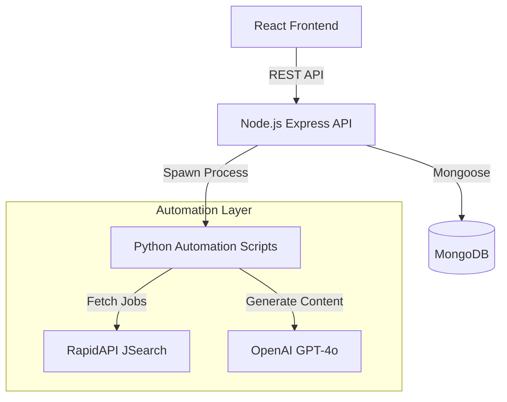

# Intern CRM - Intelligent Internship Application Manager

A simplified Customer Relationship Management (CRM) system designed tailored for managing high-volume internship applications. This full-stack solution integrates automated data aggregation, AI-powered outreach, and lifecycle tracking into a unified dashboard.

## 🚀 Key Features

*   **Automated Job Aggregation**: Fetches internship listings from external sources (via RapidAPI JSearch) using a custom Python-based ingestion pipeline.
*   **AI-Powered Outreach**: Generates personalized cold emails and LinkedIn connection notes using OpenAI (GPT-4o), integrated directly into the application workflow.
*   **Application Lifecycle Management**: Kanban-style or list-view tracking of applications from "Unassigned" to "Applied", "Interviewing", and "Offer".
*   **Role-Based Access Control (RBAC)**: secure admin and user roles for managing team-based application efforts.
*   **Interactive Analytics Dashboard**: Visualizes success rates, daily application metrics, and funnel stages using Recharts.

## 🛠️ Technical Architecture

The system follows a modular architecture where the Node.js backend acts as an orchestrator, managing the database and delegating heavy compute/AI tasks to specialized Python scripts.



## 🏗️ Tech Stack

### Frontend
*   **Framework**: React 19 (via Vite)
*   **Language**: TypeScript
*   **Styling**: Tailwind CSS
*   **State Management**: Zustand
*   **Visualization**: Recharts
*   **UI Components**: Lucide React, Custom Tailwind Components

### Backend
*   **Runtime**: Node.js
*   **Framework**: Express.js
*   **Database**: MongoDB (with Mongoose ODM)
*   **Authentication**: JWT (JSON Web Tokens)
*   **Email Service**: Nodemailer

### Automation & AI
*   **Scripting**: Python 3.12
*   **AI Provider**: OpenAI (GPT-4o)
*   **Integration Method**: `child_process` spawning from Node.js
*   **Dependencies**: `requests`, `openai`

## 📂 Project Structure

```
Intern-CRM/
├── backend/                 # Node.js API Server
│   ├── src/
│   │   ├── controllers/     # Request handlers (AI, Auth, etc.)
│   │   ├── models/          # Mongoose Schemas (Internship, User, etc.)
│   │   ├── routes/          # API Route Definitions
│   │   ├── services/        # Business Logic & Script Orchestration
│   │   └── index.ts         # Entry point
│   └── package.json
│
├── frontend/                # React Client Application
│   ├── src/
│   │   ├── components/      # Reusable UI components
│   │   ├── pages/           # Route pages (Dashboard, Internships, etc.)
│   │   └── store/           # Zustand state stores
│   └── package.json
│
├── internscript/            # Python Automation Layer
│   ├── ai_outreach.py       # OpenAI generation script
│   ├── ingest.py            # Job fetching orchestration
│   ├── internship.py        # RapidAPI integration
│   └── requirements.txt     # Python dependencies
└── README.md
```

## ⚡ Getting Started

### Prerequisites
*   Node.js (v18+)
*   Python 3.10+
*   MongoDB Instance (Local or Atlas)
*   API Keys:
    *   **OpenAI API Key** (for AI features)
    *   **RapidAPI Key** (for JSearch job fetching)

### 1. Backend Setup
Create a `.env` file in the `backend` directory:
```env
PORT=4000
MONGODB_URI=mongodb://localhost:27017/intern-crm
JWT_SECRET=your_secure_secret
# AI & Data Keys (Passed to Python scripts)
OPENAI_API_KEY=sk-...
RAPIDAPI_KEY=...
```

Install dependencies and start the server:
```bash
cd backend
npm install
npm run dev
```

### 2. Python Environment
Install Python dependencies required for the automation scripts:
```bash
# From the root directory
pip install -r internscript/requirements.txt
```

### 3. Frontend Setup
```bash
cd frontend
npm install
npm run dev
```

The application will be available at `http://localhost:5173`.

## 🔄 Data Flow: Job Fetching
1.  **Trigger**: User initiates a fetch from the frontend settings or scheduled job.
2.  **Orchestration**: `fetchJob.ts` service spawns `ingest.py`.
3.  **Execution**: `ingest.py` calls `internship.py` to query RapidAPI.
4.  **Processing**: Data is normalized and returned via `stdout` to Node.js.
5.  **Storage**: Node.js parses the JSON output and upserts records into MongoDB, handling duplicates and company associations.

## 🧠 AI Workflow: Outreach Generation
1.  **Request**: User requests an email draft for a specific internship.
2.  **Context**: Internship details and user notes are sent to `aiController.ts`.
3.  **Generation**: `aiOutreach.ts` spawns `ai_outreach.py`, passing data via `stdin`.
4.  **Inference**: Python script calls OpenAI's Chat Completion API with a specialized prompt.
5.  **Result**: Generated text is returned to the frontend for user review.

## 🛡️ License
[MIT License](LICENSE)
